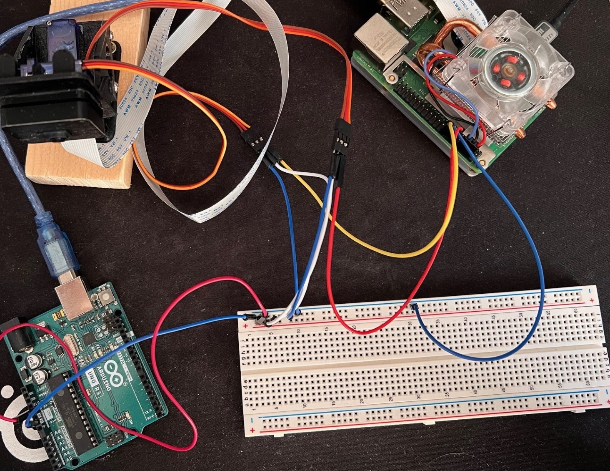
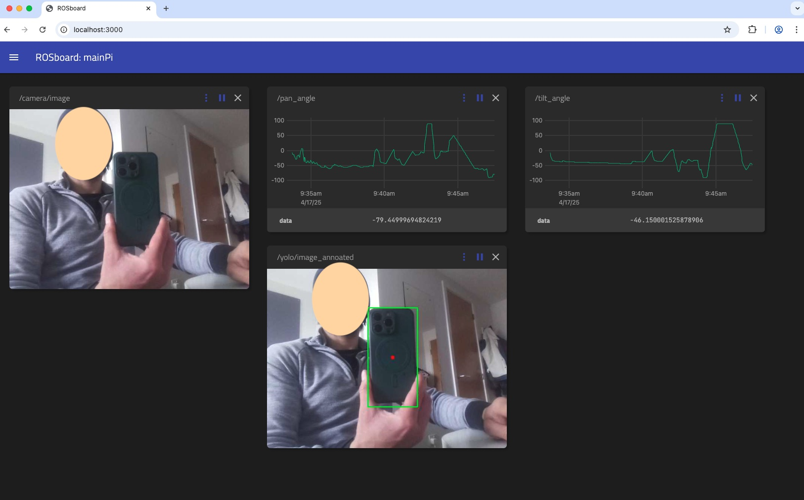

# PiTurret
Human detection and tracking Turret (mobius tilt &amp; pan) with RPI Camera v2

## Design & Hardware
- Computer: RaspberryPi 4 8GB
-  PI cooling: Low-Profile ICE [(https://thepihut.com/products/low-profile-ice-tower-raspberry-pi-4-cooler)]
- 3D prints:
  - Mobius Tilt&Pan [(https://www.thingiverse.com/thing:1401116)]
  - RPI Cam v2 case [(https://www.thingiverse.com/thing:3478855)]
- Servos 2x SG90 (cannot be powered from RPI, use external power for example Arduino module or a powerbank)
## Repo dependencies
- rosboard (for visualization) [(https://github.com/borowiak-filip/rosboard)] or Original: [(https://github.com/dheera/rosboard)]
(if port is occupied adjust the port no in rosboard.py line 35: `self.port = rospy.get_param("~port", <port number>)`

## System Requirements
Tested on Ubuntu 22.04 & ROS2 Humble

## YOLO 
tested on Yolov8 - `pip install ultralytics` (note since we are using CV_Bridge for ros, after this is installed we need to downgrade NumPy to 1.24.4 `pip install numpy==1.24.4`)

## ROS Packages
- camera_publisher: Processes camera image and publishes it as a topic /camera/image  
      `ros2 run camera_publisher camera_publisher_node`
- servo_controller: Allows to control 2x S90 servos  
      `ros2 run servo_controller servo_controller_node`  
      `ros2 topic pub /pan_angle std_msgs/msg/Float32 "{data: 45.0}"`  
      `ros2 topic pub /pan_tilt std_msgs/msg/Float32 "{data: 45.0}"`  
- yolo_tracker: Detects human/phone and adjust servos accordingly to keep the target centered  
      `ros2 run yolo_tracker yolo_tracker`  
      `ros2 run yolo_tracker yolo_tracker --ros-args -p target_class:="cell phone"`

- rosboard (optional as ros node): Web service visualization  
      `ros2 run rosboard rosboard_node`

## Demo
- go to the ros workspace: `cd <ros_ws>`
- source ros environment: `source /opt/ros/<ros_version>/setup.sh`
- build the packages: `colcon build`
- install packages: `source install/setup.sh`

In seperate terminals run:
- start GUI interface: `ros2 run rosboard rosboard_node`
- start camera node: `ros2 run camera_publisher camera_publisher_node`
- start servos: `ros2 run servo_controller servo_controller_node`
- start yolo node (human detection): `ros2 run yolo_tracker --ros-args -p target_class:="person"`
- start yolo node (phone detection): `ros2 run yolo_tracker --ros-args -p target_class:="cell phone"`

